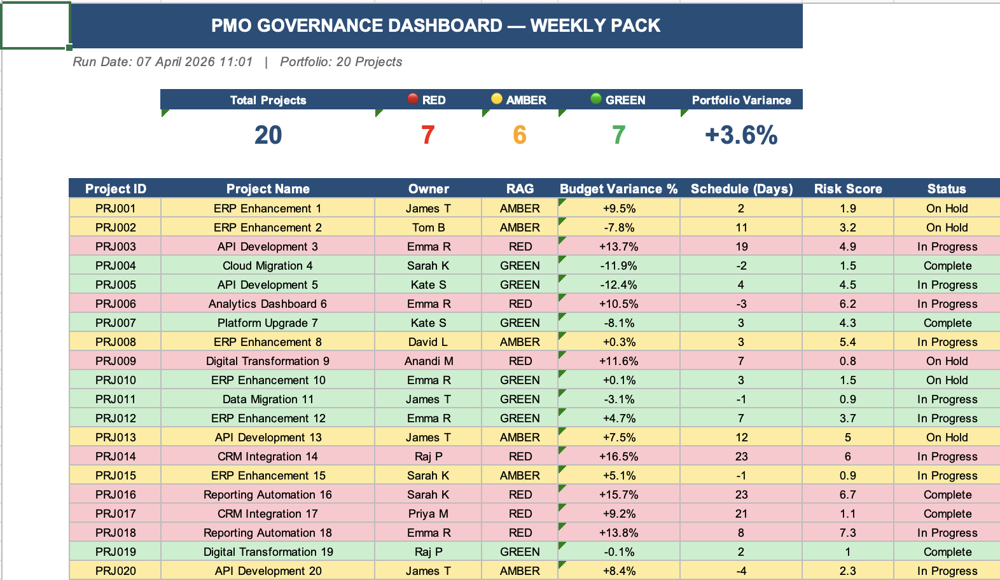

# PMO Governance Dashboard


**Author:** Anandi Mahure | MSc Data Science, University of Bath (Dean's Award 2025)
**Tools:** Python · SQL · Power BI · DAX · Excel
**Domain:** Project Management Office · Operational Governance · KPI Reporting

---

## Overview

An end-to-end PMO governance analytics system that consolidates project status, budget variance, and risk indicators into a single weekly governance pack — designed for senior leadership reporting and programme-level decision making.

Built to replicate the MI pack a PMO Analyst produces for senior stakeholders in large enterprise environments. The pipeline runs fully automated: raw project data in → formatted Excel governance pack + Power BI dataset out.

---

## Dashboard Output



*Weekly governance pack — 20 projects tracked across RAG status, budget variance, schedule slippage, and risk score.*

---

## Business Problems Solved

| Problem | Solution |
|---|---|
| Project status scattered across spreadsheets | Centralised SQL data model — single source of truth |
| RAG status manually updated each week | Automated RAG engine based on budget/schedule rules |
| No early warning for at-risk projects | Threshold-based escalation flags with 3-tier alert logic |
| Budget variance hidden in raw numbers | Variance analysis with trend, not just point-in-time |
| Leadership pack takes hours to prepare | Full pipeline runs in under 30 seconds |

---

## Live Portfolio Summary (07 April 2026)

| Metric | Value |
|---|---|
| Total Projects | 20 |
| 🔴 RED | 7 (35%) |
| 🟡 AMBER | 6 (30%) |
| 🟢 GREEN | 7 (35%) |
| Portfolio Variance | +3.6% |
| Avg Schedule Slip | 6.8 days |

---

## RAG Status Logic
```python
def calculate_rag(budget_variance_pct, schedule_variance_days, risk_score):
    if budget_variance_pct > 10 or schedule_variance_days > 14 or risk_score > 7:
        return 'RED'
    elif budget_variance_pct > 5 or schedule_variance_days > 7 or risk_score > 5:
        return 'AMBER'
    else:
        return 'GREEN'
```

---

## SQL Queries Included

| # | Query | Business Question | Technique |
|---|---|---|---|
| 1 | Portfolio RAG summary | How many projects are Red/Amber/Green? | GROUP BY + CASE |
| 2 | Budget variance by project | Which projects are over/under budget? | Actual vs planned JOIN |
| 3 | Schedule slippage tracker | Which milestones are late? | DATEDIFF + threshold |
| 4 | Resource utilisation | Who is over/under-allocated? | SUM hours + capacity |
| 5 | Risk register summary | What are the top 5 open risks? | ORDER BY + priority score |
| 6 | Monthly spend trend | Is spend tracking to forecast? | DATE + running total |
| 7 | Milestone completion rate | What % delivered on time? | COUNT + CASE + ratio |
| 8 | Dependency risk map | Which projects block others? | Self-JOIN dependency logic |

---

## Project Structurepmo-governance-dashboard/
├── data/
│   ├── projects.csv               # 20 sample projects
│   └── milestones.csv             # 80 milestone records
├── pipeline/
│   ├── rag_calculator.py          # Automated RAG status engine
│   ├── variance_analysis.py       # Budget and schedule variance
│   └── dashboard_data_prep.py     # Excel + Power BI output generator
├── sql/
│   └── pmo_queries.sql            # 8 governance queries
├── outputs/
│   ├── weekly_governance_pack.xlsx
│   ├── variance_analysis.csv
│   └── pbi_projects.csv
├── screenshots/
│   └── pmo_dashboard_output.png
├── tests/
│   └── test_rag_calculator.py     # 12 unit tests
├── requirements.txt
└── README.md

---

## How To Run
```bash
git clone https://github.com/anandi-mahure/pmo-governance-dashboard.git
cd pmo-governance-dashboard
pip install -r requirements.txt

python pipeline/rag_calculator.py
python pipeline/variance_analysis.py
python pipeline/dashboard_data_prep.py

pytest tests/ -v
```

---

## Tests

12 unit tests — all passing ✅
tests/test_rag_calculator.py::test_red_budget     PASSED
tests/test_rag_calculator.py::test_red_schedule   PASSED
tests/test_rag_calculator.py::test_green          PASSED
tests/test_rag_calculator.py::test_red_priority   PASSED
======================== 12 passed in 0.05s ========================

---

## What I Would Build Next

1. **Live data integration** — connect to Jira or MS Project API
2. **Forecasting layer** — linear regression on spend trend
3. **Email alerting** — auto-send Red project alerts every Monday
4. **Power Automate integration** — scheduled report generation

---

## Skills Demonstrated

`Python` `SQL` `Pandas` `Power BI` `DAX` `Excel` `Pytest` `RAG Status` `Variance Analysis` `Governance Reporting` `KPI Dashboards` `PMO Analytics`

---

*Built by Anandi Mahure — [LinkedIn](https://www.linkedin.com/in/anandirm/) · [GitHub](https://github.com/anandi-mahure)*
